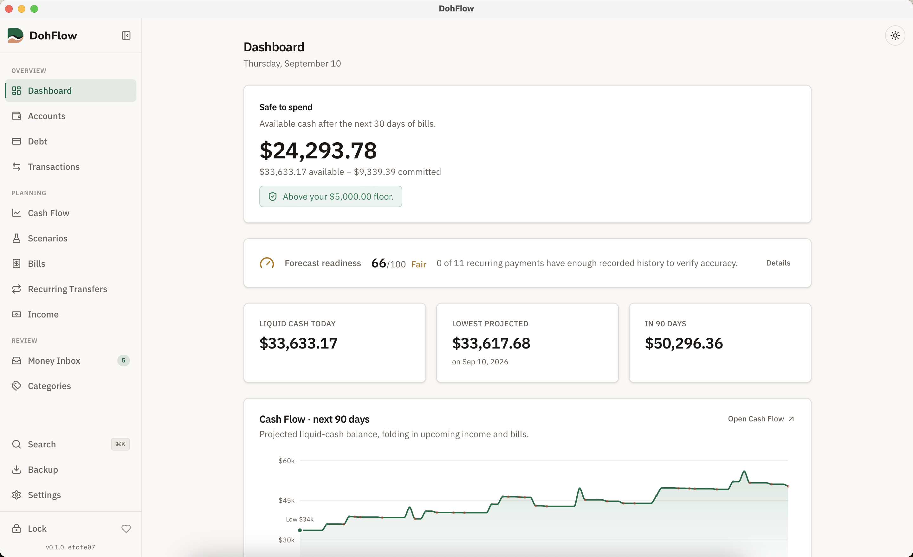

# DohFlow

[](https://github.com/dohflow/dohflow/actions/workflows/ci.yml)
[](https://github.com/dohflow/dohflow/releases/latest)
[](https://github.com/dohflow/dohflow/releases)
[](https://github.com/sponsors/chrisbustos)
[](LICENSE)

> Local-first household finance desktop app. Encrypted vault. Forecast-first.
> Your data never leaves your machine unless you explicitly send it somewhere.
> See the [privacy fact sheet](docs/public/privacy.md) for exactly what that means.

DohFlow treats a household like a small business: balance sheet, income
statement, cash flow, debt schedule, scenario planning. The differentiator is
the **Cash Flow forecast** — a household liquidity projection with explainable
assumptions, empirical confidence bands, and risk flags, built from your own
data and inspectable down to every assumption.

<!-- personal-cfo-n76x.13: Dashboard/forecast, chosen as the hero because
     it's the surface a new visitor forms a first impression from. Captured
     against the Polish Demo fixture vault (docs/agent/demo-vault.md) — no
     real household data. GitHub's documented dark/light picture convention:
     https://docs.github.com/en/get-started/writing-on-github/getting-started-with-writing-and-formatting-on-github/basic-writing-and-formatting-syntax#specifying-the-theme-an-image-is-shown-to -->
<picture>
  <source media="(prefers-color-scheme: dark)" srcset="docs/assets/hero-dark.png">
  <source media="(prefers-color-scheme: light)" srcset="docs/assets/hero-light.png">
  
</picture>

## Download

**[Download for macOS (Apple silicon or Intel)](https://github.com/dohflow/dohflow/releases/latest)**
— a signed, notarized `.dmg`. Manual entry works fully offline; connecting a
bank account (via [SimpleFIN](https://www.simplefin.org)) is optional.

### What you'll see on first launch

DohFlow is signed and notarized by Apple, so opening it is the same as
opening any other Mac app — **no "Open Anyway" workaround, no right-click
override.** macOS's Gatekeeper shows a plain confirmation the first time you
open it, and never again after that: "'DohFlow' downloaded from the
internet. Are you sure you want to open it?", with "Apple checked it for
malicious software and none was detected" underneath.

A few things worth knowing up front:

- **We will never ask you to bypass Gatekeeper.** If you're ever told to
  right-click → Open, disable Gatekeeper, or run a Terminal command to "fix"
  a security warning when installing DohFlow, that is not us — stop and
  verify you downloaded from
  [this repository's Releases page](https://github.com/dohflow/dohflow/releases),
  not a third-party mirror.
- Every release's `.dmg` is signed; you can verify its SHA-256 checksum
  against the value published alongside each release if you want to confirm
  the download wasn't tampered with in transit.
- Auto-update is signed too — DohFlow checks a single pinned, signed release
  feed and refuses to install an update whose signature doesn't match.

## Status

**Pre-release, and used daily on real financial data by its own developer —
this is not a demo build.** The app is feature-complete for its 1.0 wedge:
what remains before a public release is packaging, review, and polish, not
core functionality.

**Known limitations** — platform, connectors, accessibility, and a few
specific gaps, stated plainly — are listed at
[dohflow.app/help/known-limitations](https://dohflow.app/help/known-limitations).

### What works today

- **Encrypted vault** — SQLCipher at rest, Argon2id KDF, zeroized key
  handling, versioned migrations with drift detection, encrypted backup
  export + verified restore, multi-vault switching.
- **Ledger** — double-entry postings with DB-side balance invariants, an
  append-only operation log, idempotent commands, rebuildable read models.
- **Getting data in** — CSV/OFX/QFX file import through a staged-ingestion
  pipeline (parse → stage → dedupe → review → commit; raw bytes are never
  persisted), and **direct bank sync via SimpleFIN** — link with a pasted
  setup token, no developer keys, no relay server, verified end-to-end
  against the live SimpleFIN demo Bridge.
- **Money Inbox** — one triage surface for imported rows, suspected
  duplicates, unreviewed transactions, low-confidence categories, stale
  balances, and connection problems.
- **Categorization** — searchable category picker, splits, tags, merchant
  memory with auto-apply on import.
- **Recurring** — bills and transfers with schedule detection, provenance,
  autopay tracking, and past-due confirmation.
- **Cash Flow** — the daily liquidity forecast with statement-aware credit
  card modeling, empirical uncertainty bands, forecast-readiness scoring,
  backtested accuracy (MAPE), and a needs-confirmation queue.
- **Scenarios** — compose several what-ifs with explicit precedence, diff the
  conflicts, apply onto real data with full provenance and reversal.
- **Debt** — terms, statement projections, payoff comparison
  (avalanche/snowball) with color-vision-checked charts.
- **Portability** — plaintext CSV export (deterministic, round-trips through
  the importer), encrypted backups.
- **Distribution** — signed + notarized macOS DMG, with an in-app auto-update
  channel: a minisign-signed release feed, tampered-artifact refusal, and a
  live smoke-tested round trip (ADR 0068).

Manual entry is always sufficient: a connected account is an enhancement,
**never** a dependency.

**Get it:** [Download](#download) above for the signed macOS build, or
[Development setup](#development-setup) below to build from source.

## Architecture

- **Tauri v2** desktop shell, macOS-first.
- **Rust** trusted core (the "Finance Kernel") owns every financial state
  mutation behind typed commands. No frontend, importer, connector, or AI
  agent writes ledger state directly.
- **React + TypeScript (strict)** frontend in the system WebView —
  presentation only: no DB, no keys, no provider credentials.
- **SQLCipher** local vault; per-attachment content keys; credentials for
  bank connections live inside the vault so backups carry them.
- **Hybrid persistence**: normalized relational ledger + immutable operation
  log; read models are rebuildable, checksummed projections.
- **Connectors** hold no project-owned secrets — SimpleFIN's user-token flow
  runs entirely client-side (ADR 0004/0060), and untrusted bytes parse inside
  bounded, isolated workers (ADR 0022).
- **AI agents** (future) are read-only, schema-validated, evidence-citing
  report generators — never writers.

The workspace: `core-money`, `core-ids`, `core-ledger`, `vault-crypto`,
`db-worker`, `finance-kernel`, `forecast-engine`, `pay-schedule`,
`categorization`, `observability`, `synthetic-data`,
`importers/{importer-core,csv-importer,ofx-importer}`,
`connector-core`, `connectors/simplefin-adapter` (Rust), and `apps/desktop`
(Tauri + React). 55 Architecture Decision Records under `docs/adr/` document
what was decided, why, and what was rejected.

## Development setup

Prerequisites: **Rust** (via rustup; toolchain pinned in `rust-toolchain.toml`),
**Node ≥ 20**, and **pnpm** (`corepack enable` or `brew install pnpm`). The Tauri
desktop build additionally needs the platform prerequisites from
<https://v2.tauri.app/start/prerequisites/> (on macOS, the Xcode Command Line
Tools).

```bash
# Frontend (apps/desktop)
pnpm install
pnpm typecheck            # tsc --noEmit (strict)
pnpm lint                 # eslint
pnpm test                 # vitest
pnpm -C apps/desktop build

# Rust workspace (gates are active)
cargo test --workspace
cargo clippy --workspace --all-targets -- -D warnings
cargo fmt --check

# The desktop crate is its own workspace (needs apps/desktop/dist first)
cd apps/desktop/src-tauri && cargo test

# Run the desktop app in dev (Tauri)
pnpm -C apps/desktop tauri dev
```

CI runs the same gates plus invariant/boundary checks, secret scanning
(gitleaks over full history), and dependency audits — see
`.github/workflows/ci.yml`.

## Contributing

See [`AGENTS.md`](AGENTS.md) for the conventions this project follows —
branching, commits, and the non-destructive defaults that apply whether
you're a person or an AI coding assistant. Bug reports and feature
requests go through [GitHub Issues](https://github.com/dohflow/dohflow/issues/new/choose).

## What you can count on

- The app is fully useful without ever connecting an account — manual
  entry is complete on its own; a connected account is an enhancement,
  never a requirement.
- Your financial data is encrypted at rest.
- Every forecast row is inspectable and editable — you can see and
  change the exact assumption behind any number.
- You can override any category, recurring event, assumption, or
  forecast item.
- AI never makes a transaction, payment, transfer, trade, or destructive
  edit on your behalf — only reads and reports.

## Key documents

| Doc | Purpose |
|---|---|
| `docs/planning/personal-finance-app-project-plan.md` | The master project plan — phases, deliverables, gate criteria |
| `AGENTS.md` | AI agent operating instructions (non-destructive defaults, branch-first workflow, beads conventions) |
| `docs/agent/PROJECT_PROFILE.md` | Stack, quality gates, sensitive-data rules |
| `docs/architecture/definition-of-done.md` | Per-feature test + logging + redaction obligations |
| `docs/adr/00NN-*.md` | Architecture Decision Records |
| `SECURITY.md` | Security policy + how to report a vulnerability |
| [`docs/public/privacy.md`](docs/public/privacy.md) | Plain-language privacy fact sheet: what stays on your Mac, what can leave it, and why |

## License

**AGPL-3.0-only** ([full text](LICENSE)), with a Contributor License
Agreement — an automated bot asks for a one-time signature on your first
PR. See ADR 0043 (`docs/adr/0043-oss-license.md`) for why AGPL-3.0 plus a
CLA, and [`CLA.md`](CLA.md) for the agreement itself. The DohFlow name and
logo are governed separately from the code license — see
[`TRADEMARK.md`](TRADEMARK.md).

## History

This repository is a single-commit public snapshot, not a full development
history. DohFlow was built privately from May 2026; the pre-release commit
history and pull-request record stay in the maintainer's private archive
rather than being published here — a deliberate choice to keep personal
dogfooding data out of the public record, not a gap (ADR 0062's 2026-09-08
amendment). The Architecture Decision Records under `docs/adr/` and this
CHANGELOG carry the development narrative independent of commit history.

## Disclaimer

DohFlow produces forecasts and risk indicators. Per ADR 0018, the product
uses **descriptive** language ("at current rate, your liquid cash reaches the
floor on date Z") and **never** prescriptive language ("you should pay off X
first"). DohFlow is not financial, tax, or investment advice. Forecasts
are best-effort estimates from your own historical data; outcomes will differ.
